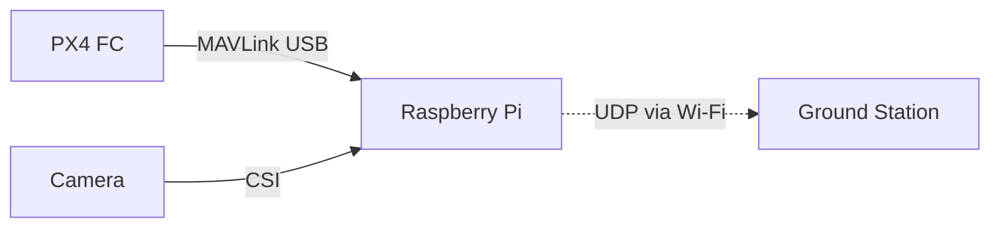

# 🛰️ Long-Range FPV & Telemetry System using PX4 + Raspberry Pi

This project enables **bi-directional telemetry and FPV video transmission** using a Raspberry Pi 3, PX4 flight controller, and long-range Wi-Fi modules. It is designed for **low-latency field deployment**, ideal for drones with no internet access.

---

## 📦 Hardware Used

| Component              | Description                                 |
|------------------------|---------------------------------------------|
| Flight Controller      | PX4-based (e.g., CUAV X7)                   |
| SBC                    | Raspberry Pi 3 (Raspbian Bookworm Lite)     |
| Camera                 | Pi Camera 2 (CSI Interface)                 |
| Wi-Fi Module (Client)  | BL-M8812CU2                                 |
| Wi-Fi Module (AP)      | BL-M8197FH1                                 |
| Ground Station         | Windows Laptop (Surface Pro)                |

---

## 🔧 Network Setup



- **PX4 → Pi**: MAVLink over USB (`/dev/ttyACM0`)
- **Pi → GCS**: Telemetry (UDP 14550) + FPV video (UDP 5600)

---

## 🛠️ Software Stack

- [x] **MAVProxy** – Telemetry routing
- [x] **GStreamer** – Live FPV streaming
- [x] **ffmpeg** – Optional recording
- [x] **Mission Planner** – Ground Control Station (GCS)

---

## 🧩 Dependencies

### 📦 Raspberry Pi (Raspbian Bookworm Lite)

```bash
# Update system
sudo apt update && sudo apt upgrade -y

# Install system packages
sudo apt install -y python3-pip python3-venv screen gstreamer1.0-tools \
gstreamer1.0-plugins-good gstreamer1.0-plugins-base gstreamer1.0-plugins-bad \
gstreamer1.0-libav libgstreamer1.0-dev net-tools ffmpeg

# Optional: Remove ModemManager to avoid PX4 USB port conflict
sudo apt remove -y modemmanager
```

### 🐍 Setup Python Virtual Environment

```bash
# Create venv
python3 -m venv ~/venv
source ~/venv/bin/activate

# Install MAVProxy
pip install --upgrade pip
pip install MAVProxy
```

### 🧪 Test MAVProxy

```bash
~/venv/bin/mavproxy.py --master=/dev/ttyACM0 --baudrate 115200
```

You should see MAVLink output after PX4 is connected via USB.

---

## 📦 Ground Station (Windows)

Install:

- **[Mission Planner](https://ardupilot.org/planner/docs/mission-planner-installation.html)**
- **[GStreamer (Windows SDK)](https://gstreamer.freedesktop.org/download/)**  
  (Install *Complete* or *Runtime* version)
- **[ffmpeg](https://ffmpeg.org/download.html)** (optional)


## ⚙️ Raspberry Pi Setup

### 1. 🖥️ Static IP Configuration

Edit netplan config:

```bash
sudo nano /etc/netplan/99-dhcp.yaml
```

Paste:

```yaml
network:
  version: 2
  renderer: networkd
  wifis:
    wlan0:
      dhcp4: no
      addresses:
        - 192.168.0.152/24
      gateway4: 192.168.0.1
      nameservers:
        addresses: [8.8.8.8, 1.1.1.1]
      access-points:
        "YOUR_WIFI_SSID": {}
```

Apply it:

```bash
sudo netplan apply
```

---

### 2. 🧪 Telemetry Script – `start_mavproxy.sh`

```bash
#!/bin/bash
sleep 20
/home/da/venv/bin/python /home/da/venv/bin/mavproxy.py \
  --master=/dev/ttyACM0 \
  --baudrate 115200 \
  --out=192.168.0.150:14550 \
  --aircraft /home/da/mydrone \
  >> /home/da/mavproxy.log 2>&1
```

Make executable:
```bash
chmod +x ~/start_mavproxy.sh
```

Add to crontab:
```bash
crontab -e
@reboot /home/da/start_mavproxy.sh &
```

---

### 3. 📹 FPV Streaming – `fpvstream.sh`

```bash
#!/bin/bash
sleep 10
gst-launch-1.0 libcamerasrc ! video/x-raw,width=1280,height=720,framerate=30/1 ! \
  videoconvert ! x264enc tune=zerolatency bitrate=800 speed-preset=ultrafast ! \
  rtph264pay config-interval=1 pt=96 ! udpsink host=192.168.0.150 port=5600
```

Make executable:
```bash
chmod +x ~/fpvstream.sh
```

Add to crontab:
```bash
@reboot /home/da/fpvstream.sh &
```

---

## 🧭 Ground Station (Windows)

- Set static IP: `192.168.0.150`
- Run **Mission Planner**
  - Go to **UDP** → Port `14550`
- Run GStreamer to receive FPV:

```bash
gst-launch-1.0 udpsrc port=5600 caps="application/x-rtp, encoding-name=H264, payload=96" ! \
rtph264depay ! avdec_h264 ! videoconvert ! autovideosink
```

---

## 🚧 To Do

- [ ] Auto-restart on Wi-Fi loss
- [ ] Add telemetry loss watchdog
- [ ] Upgrade to Pi 4 for better encoding performance

---

## 📄 License

MIT License. Use at your own risk in flight-critical systems.

---

## ✈️ Maintained By

[Your Name or Team]  
[GitHub Repo or Company URL]
---
