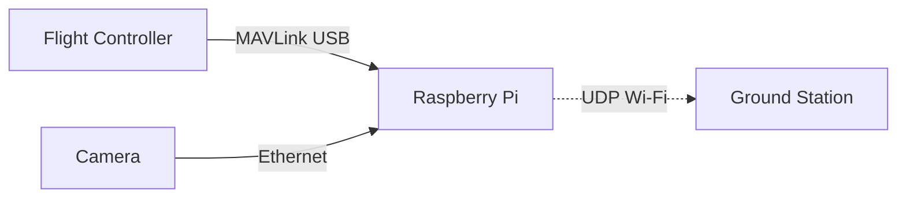

# 🚁️ Long-Range FPV & Telemetry System (PX4 + Raspberry Pi)

A robust, open-source system for **real-time FPV video and MAVLink telemetry** using a Raspberry Pi and PX4 flight controller. Designed for drone developers, field engineers, and UAV enthusiasts.

---

## 🚀 Project Goals

- ✅ **Plug-and-Play OS Image** – Flash and fly. A custom Raspberry Pi OS that auto-starts telemetry and video links.
- ✅ **Developer Mode** – Easy-to-install development environment.
- ✅ **Open Source** – Transparent, customizable, and community-friendly.

---

## 📦 Hardware Requirements

| Component             | Example / Details                   |
| --------------------- | ----------------------------------- |
| Flight Controller     | PX4 (CUAV X7 or similar)            |
| SBC (Linux)           | Raspberry Pi 3 or 4 (64-bit OS)     |
| Camera                | Pi Camera 2 (CSI) or USB UVC Camera |
| Wi-Fi Module (Client) | BL-M8812CU2 (5GHz)                  |
| Wi-Fi AP Module       | BL-M8197FH1 or Router in AP mode    |
| Ground Station        | Windows PC with QGroundControl     |

---

## 🛠️ System Overview



---

## 🌐 Network Configuration

| Device         | Role           | Static IP       |
| -------------- | -------------- | --------------- |
| Raspberry Pi   | Drone-side SBC | `192.168.0.151` |
| Ground Station | GCS (Windows)  | `192.168.0.150` |
| Wi-Fi AP       | Router/AP      | `192.168.0.1`   |

---

## 🔧 Wiring & Connections

- **PX4 → Raspberry Pi** via USB-C to USB-A cable
- **SiYi a8 mini Camera** connected to **Ethernet** on Pi
- **Wi-Fi USB Dongle** connected to Pi
- **Ground Station** connected to AP via Wi-Fi

> ✅ Make sure to power the PX4 and Pi **independently but safely**.

---

## 🧪 Developer Setup

### 1. Flash Raspberry Pi OS (Bookworm Lite)

Download 64-bit Lite version from [raspberrypi.com](https://www.raspberrypi.com/software/operating-systems/)Flash using [Raspberry Pi Imager](https://www.raspberrypi.com/software/)

---

### 2. Configure Static IP

Edit `/etc/netplan/99-dhcp.yaml`:

```yaml
network:
  version: 2
  renderer: networkd
  wifis:
    wlan0:
      dhcp4: no
      addresses: [192.168.0.152/24]
      gateway4: 192.168.0.1
      nameservers:
        addresses: [8.8.8.8, 1.1.1.1]
      access-points:
        "YOUR_SSID": {}
```

Then:

```bash
sudo netplan apply
```

---

### 3. Install Dependencies

```bash
sudo apt update && sudo apt install -y python3-pip python3-venv screen \
gstreamer1.0-tools gstreamer1.0-plugins-{good,bad,base} gstreamer1.0-libav \
net-tools ffmpeg

sudo apt remove -y modemmanager  # PX4 conflict
```

---
### 4. Setup Environment Variables 
Create `.env` in /home/pi/mydrone directory:

```bash
nano /home/pi/mydrone/.env
```

Paste the following:

```bash
# MAVProxy configuration
MAVLINK_DEVICE=/dev/ttyACM0
MAVLINK_BAUD=115200
GCS_IP=192.168.0.150
GCS_PORT=14550
AIRCRAFT_PATH=/home/pi/mydrone

# Video streaming
VIDEO_URL=rtsp://192.168.144.25:8554/main.264
VIDEO_WIDTH=1280
VIDEO_HEIGHT=720
VIDEO_BITRATE=1024
VIDEO_FPS=30
VIDEO_PORT=5600
```


### 5. Setup MAVProxy (Telemetry)

```bash
python3 -m venv ~/venv
source ~/venv/bin/activate
pip install --upgrade pip
pip install MAVProxy
```

Create `/home/pi/start_mavproxy.sh`:

```bash
#!/bin/bash

# Load environment variables
set -o allexport
source /home/pi/mydrone/.env
set +o allexport

LOGFILE="/home/da/mavproxy.log"

echo "⏳ Waiting for /dev/ttyACM0..." | tee -a "$LOGFILE"
while [ ! -e $MAVLINK_DEVICE ]; do sleep 2; done

echo "⏳ Waiting for Wi-Fi..." | tee -a "$LOGFILE"
until iw wlan0 link | grep -q "Connected"; do sleep 2; done

echo "✅ PX4 and Wi-Fi ready. Starting MAVProxy..." | tee -a "$LOGFILE"
/home/pi/venv/bin/python /home/pi/venv/bin/mavproxy.py \
    --master=${MAVLINK_DEVICE} \
    --baudrate=${MAVLINK_BAUD} \
    --out=${GCS_IP}:${GCS_PORT} \
    --aircraft=${AIRCRAFT_PATH} \
    --daemon \
    | tee -a "$LOGFILE"

echo "❌ MAVProxy exited unexpectedly at $(date)" | tee -a "$LOGFILE"
```

Make executable:

```bash
chmod +x /home/pi/start_mavproxy.sh
```

Create **Systemd Service** `/etc/systemd/system/mavproxy.service`:

```ini
[Unit]
Description=MAVProxy Service for Companion Computer
After=network-online.target
Wants=network-online.target

[Service]
user=pi
EnvironmentFile=/home/pi/mydrone/.env
ExecStart=/home/pi/start_mavproxy.sh
Restart=on-failure
RestartSec=10

[Install]
WantedBy=multi-user.target
```

Enable and start:

```bash
sudo systemctl daemon-reexec
sudo systemctl daemon-reload
sudo systemctl enable mavproxy.service
sudo systemctl start mavproxy.service
```

---

### 5. Setup FPV Streaming (GStreamer)

Create `start_stream.sh`:

```bash
#!/bin/bash
source /home/pi/mydrone/.env

gst-launch-1.0 rtspsrc location=$VIDEO_URL latency=0 ! \
rtph265depay ! rtph265pay config-interval=1 pt=96 mtu=1200 ! \
udpsink host=$GCS_IP port=$VIDEO_PORT

```

Make executable:

```bash
chmod +x /home/pi/start_stream.sh
```

Create `/etc/systemd/system/fpvstream.service`:

```ini
[Unit]
Description=FPV Video Stream via GStreamer
After=multi-user.target

[Service]
user=pi
EnvironmentFile=/home/pi/mydrone/.env
ExecStart=/home/pi/start_stream.sh
Restart=on-failure
RestartSec=5

[Install]
WantedBy=multi-user.target
```

Enable and start:

```bash
sudo systemctl daemon-reload
sudo systemctl enable fpvstream.service
sudo systemctl start fpvstream.service
```

---

## 🌟 Ground Station Setup (Windows)

- Set static IP to `192.168.0.150`
- Open **QGC → UDP → Port 14550**
- Wait for connection

---

## 📦 Deliverables

| Target         | Status   | Notes                                     |
|----------------|----------|-------------------------------------------|
| Plug & Play OS | 🚧 WIP    | Will provide `.img` file with services    |
| Dev Scripts    | ✅ Done   | Systemd-based setup included              |
| Docs           | ✅ Done   | This README                              |

---

## 👥 Contributing

Want to help? Feel free to fork, open issues, or submit pull requests!

---

## 📄 License

MIT License – Free to use, modify, and distribute.

---

## ✈️ Maintained By

[Aniket]  
[github](https://github.com/Aniket-89/project-indra)
