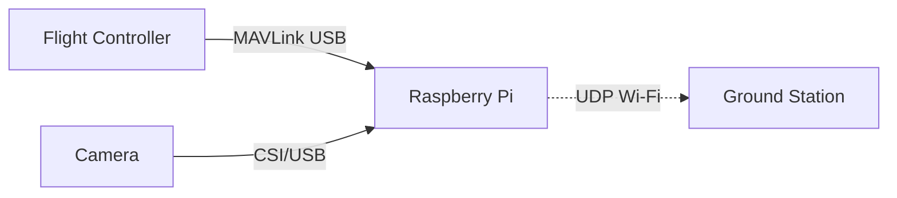

# 🛰️ Long-Range FPV & Telemetry System (PX4 + Raspberry Pi)

A robust, open-source system for **real-time FPV video and MAVLink telemetry** using a Raspberry Pi and PX4 flight controller. Designed for drone developers, field engineers, and UAV enthusiasts.

---

## 🚀 Project Goals

- ✅ **Plug-and-Play OS Image** – Flash and fly. A custom Raspberry Pi OS that auto-starts telemetry and video links.
- ✅ **Developer Mode** – Easy-to-install development environment.
- ✅ **Open Source** – Transparent, customizable, and community-friendly.

---

## 📦 Hardware Requirements

| Component            | Example / Details                      |
|---------------------|----------------------------------------|
| Flight Controller    | PX4 (CUAV X7 or similar)               |
| SBC (Linux)          | Raspberry Pi 3 or 4 (64-bit OS)        |
| Camera               | Pi Camera 2 (CSI) or USB UVC Camera    |
| Wi-Fi Module (Client)| BL-M8812CU2 (5GHz)                     |
| Wi-Fi AP Module      | BL-M8197FH1 or Router in AP mode       |
| Ground Station       | Windows PC with Mission Planner        |

---

## 🛠️ System Overview



---

## 🌐 Network Configuration

| Device        | Role          | Static IP         |
|---------------|---------------|-------------------|
| Raspberry Pi  | Drone-side SBC| `192.168.0.152`   |
| Ground Station| GCS (Windows) | `192.168.0.150`   |
| Wi-Fi AP      | Router/AP     | `192.168.0.1`     |

---

## 🔧 Wiring & Connections

- **PX4 → Raspberry Pi** via USB-C to USB-A cable
- **Pi Camera** connected to **CSI port** on Pi
- **Wi-Fi USB Dongle** connected to Pi
- **Ground Station** connected to AP via Wi-Fi

> ✅ Make sure to power the PX4 and Pi **independently but safely**.

---

## 🧪 Developer Setup

### 1. Flash Raspberry Pi OS (Bookworm Lite)

Download 64-bit Lite version from [raspberrypi.com](https://www.raspberrypi.com/software/operating-systems/)  
Flash using [Raspberry Pi Imager](https://www.raspberrypi.com/software/)

---

### 2. Configure Static IP

Edit `/etc/netplan/99-dhcp.yaml`:

```yaml
network:
  version: 2
  renderer: networkd
  wifis:
    wlan0:
      dhcp4: no
      addresses: [192.168.0.152/24]
      gateway4: 192.168.0.1
      nameservers:
        addresses: [8.8.8.8, 1.1.1.1]
      access-points:
        "YOUR_SSID": {}
```

Then:
```bash
sudo netplan apply
```

---

### 3. Install Dependencies

```bash
sudo apt update && sudo apt install -y python3-pip python3-venv screen \
gstreamer1.0-tools gstreamer1.0-plugins-{good,bad,base} gstreamer1.0-libav \
net-tools ffmpeg

sudo apt remove -y modemmanager  # PX4 conflict
```

---

### 4. Setup MAVProxy (Telemetry)

```bash
python3 -m venv ~/venv
source ~/venv/bin/activate
pip install --upgrade pip
pip install MAVProxy
```

Create `start_mavproxy.sh`:

```bash
#!/bin/bash
sleep 20
/home/da/venv/bin/python /home/da/venv/bin/mavproxy.py \
  --master=/dev/ttyACM0 --baudrate 115200 \
  --out=192.168.0.150:14550 --aircraft /home/da/mydrone \
  >> /home/da/mavproxy.log 2>&1
```

---

### 5. Setup FPV Streaming

Create `fpvstream.sh`:

```bash
#!/bin/bash
sleep 10
gst-launch-1.0 libcamerasrc ! video/x-raw,width=1280,height=720,framerate=30/1 ! \
  videoconvert ! x264enc tune=zerolatency bitrate=800 speed-preset=ultrafast ! \
  rtph264pay config-interval=1 pt=96 ! udpsink host=192.168.0.150 port=5600
```

---

### 6. Auto Start Scripts (Crontab)

```bash
crontab -e
@reboot /home/da/start_mavproxy.sh &
@reboot /home/da/fpvstream.sh &
```

---

## 🎯 Ground Station Setup (Windows)

- Set static IP to `192.168.0.150`
- Open **Mission Planner → UDP → Port 14550**
- Use this GStreamer command to receive video:

```bash
gst-launch-1.0 udpsrc port=5600 caps="application/x-rtp, encoding-name=H264, payload=96" ! \
rtph264depay ! avdec_h264 ! videoconvert ! autovideosink
```

---

## 📦 Planned Deliverables

| Target         | Status   | Notes                                     |
|----------------|----------|-------------------------------------------|
| Plug & Play OS | 🚧 WIP    | Will provide `.img` file with services    |
| Dev Scripts    | ✅ Done   | Crontab-based setup included              |
| Docs           | ✅ Done   | This README                              |

---

## 👥 Contributing

Want to help? Feel free to fork, open issues, or submit pull requests!

---

## 📄 License

MIT License – Free to use, modify, and distribute.

---

## ✈️ Maintained By

[YourName or Team]  
https://github.com/yourusername/project-name
